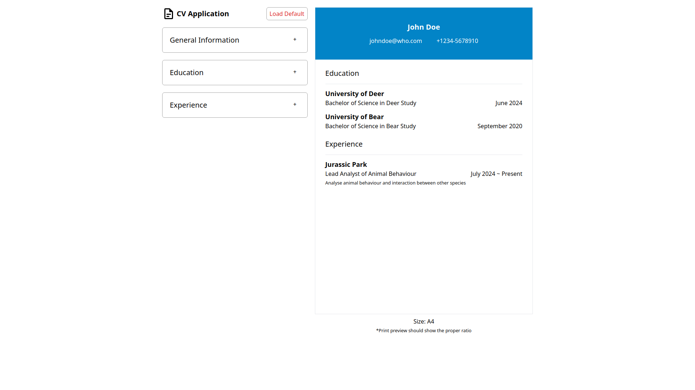

# CV Application

### [Demo](#)

### About:

A project for The Odin Project: React Course's [Project: CV Application](https://www.theodinproject.com/lessons/node-path-react-new-cv-application). It allows you to update your CV and print it. Paper ratio is defaulted to A4 size.

Made with Vite.

### Note:

The CV might look weird on some devices but print preview should show the proper ratio.

### Screenshot:

### Languages:

- HTML
- CSS
- JavaScript

### Library:

- React

### Framework:

- Tailwind CSS

### Formatter:

- Prettier

### Resources:

- [Document Icon](https://pictogrammers.com/library/mdi/)
